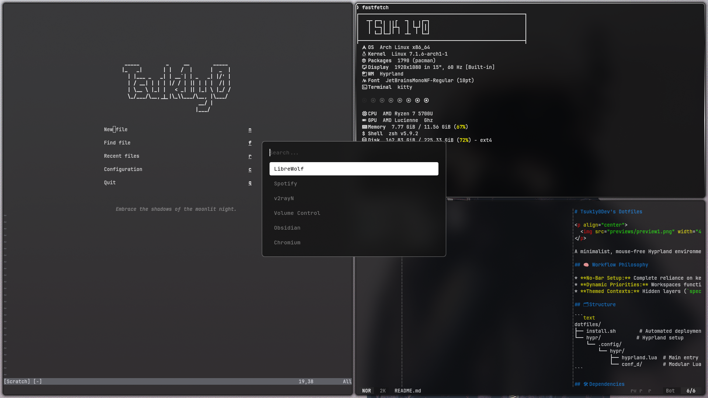

<style>
  html { 
    filter: invert(1) hue-rotate(180deg); 
    background-color: #fff !important; 
  }
  
  img, svg, video { 
    filter: invert(1) hue-rotate(180deg); 
  }

  @media screen and (min-width: 64em) {
    header { width: 200px !important; }
    section { width: calc(100% - 260px) !important; max-width: 900px !important; margin-left: 240px !important; }
  }
</style>

# Tsuk1y0Dev's Dotfiles

<p align="center">
  
</p>

A minimalist, mouse-free Hyprland environment built with a Lua-based configuration ecosystem. 

## 🧠 Workflow Philosophy

* **No-Bar Setup:** Complete reliance on keyboard muscle memory, shortcuts, and notifications. Every pixel is dedicated to applications.
* **Dynamic Priorities:** Workspaces function as a living stream. Lower indices represent current focus, higher indices represent lower priority.
* **Themed Contexts:** Hidden layers (`special:tech`, `special:social`, `special:main`) separate background processes (Spotify, Carla, messaging) from active workspaces without screen real estate fragmentation.

## 🗂 Structure

```text
dotfiles/
├── install.sh        # Automated deployment script
└── hypr/            # Hyprland setup
    └── .config/
        └── hypr/
            ├── hyprland.lua  # Main entry point (automated loading cycle)
            └── conf_d/       # Modular Lua configurations
```

## 🛠 Dependencies

The installation script automatically manages the following dependencies:

* **Core:** `hyprland` (with Lua framework), `stow`, `git`
* **Utilities:** `swaync`, `rofi`, `awww-daemon`, `grimblast` (AUR), `hyprlock`, `brightnessctl`, `wireplumber`, `playerctl`

## 🚀 Installation

Clone the repository and run the automated installation script. Do not run it as root.

```bash
mkdir -p ~/System
git clone https://github.com/Tsuk1y0Dev/dotfiles.git ~/System/dotfiles
cd ~/System/dotfiles
chmod +x install.sh
./install.sh
```

## ⚙️ Customization

System configuration is fully controlled via `hypr/.config/hypr/conf_d/_00-vars.lua`. 

If the installation script detects a non-author system, it automatically flips the `is_author_system` flag to `false`. This prevents personal background services (Carla profiles, Spotify, specialized messengers) from executing during startup on external machines.

## License

This project is licensed under the MIT License.
